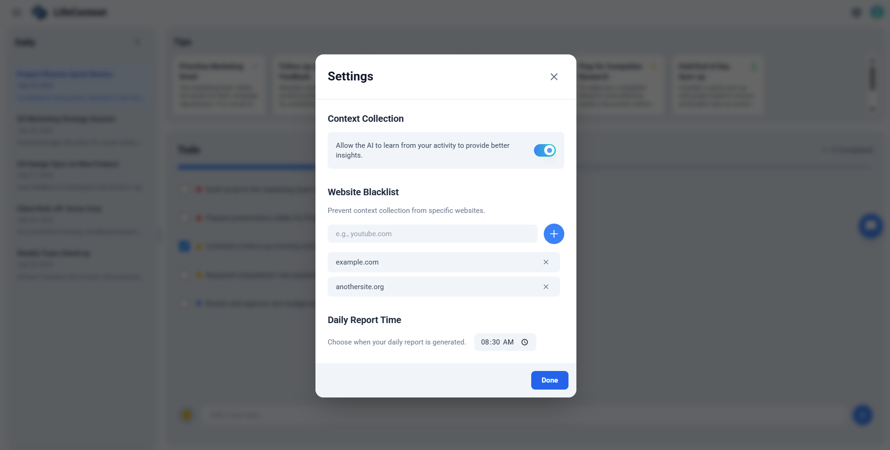

# 🧠 LifeContext

​[中文](readme_zh.md) / English

## 🌍 What is Life Context

* Transforms what you **see, hear, and do** into AI-readable context — enabling AI to truly understand you and act proactively.
* Serves as your **digital memory**, helping LLMs comprehend your life experiences.
* Provides **open-source implementations** and standardized context APIs.

## 🎯 Core Features

* **Life Context Base:** Intelligently builds your life context across webpages, apps, and smart devices — continuously evolving with your experiences.
* **Context API:** Offers unified interfaces for developers to store, retrieve, and manage contextual data — making cross-platform integration easy.
* **Companion Insights:** Automatically generates smart tips, to-dos, and daily reports — surfacing the moments, ideas, and priorities that truly matter to you.
* **Context Chat:** Naturally interact with your personal AI companion — helping you complete any task anytime, anywhere.

## 🧩 Current Version

* Focuses on your primary workspace — **web browser** — building an active and intelligent presence.
* Automatically analyzes the webpages you visit to construct your **digital life context**.
* Stays out of your way while providing timely, actionable insights.
* Code coming soon as **open source**.

## **🚀** Quick Start

1. Please install and activate the LifeContext browser extension. 
2. On any webpage, you can click the floating button to open the chatbox and freely interact with your life context.

3. LifeContext will silently record all your browsing experiences and generate smart tips, to-do lists, and daily reports based on them, which will appear as instant notifications on the right side of the webpage you are browsing. You can also view all the information on the homepage.

- Tips are content recommended based on your browsing information. You can click on the card to view detailed tips.

- The to-do list is automatically generated based on your activities. You can manually edit, delete, or add to-dos.

- Click the date in the left sidebar of the homepage to view the details of that day's daily report. The default generation time is 8:30 the following day, which you can modify in the settings.

4. Privacy issues

- If you do not want certain websites recorded in your life context, you can block the corresponding URL in the settings. If you do not want to record any browsing activity, you can disable the browser extension.

- You can also manage storage by selecting the Timeline page at the top left of the homepage and delete pages you do not want to retain in LifeContext.

## 🤖 Development Progress

### 🧰 Context Source Expansion Roadmap 

To enable AI to understand users better, we will integrate the following context sources in phases, based on priority.

- P0: Browser web data
- P1: Documents
- P2: Common application MCP and PC screenshots
- P3: Audio/Video files and smart hardware
- P4: DeepResearch and RSS
- P5: Mobile phone screenshots
- P6: Community knowledge base

| Priority | Integration Method       | Content                               | Progress |
| :------- | :----------------------- | :------------------------------------ | :------- |
| P0       | Browser Extension        | AI Chat                               |     ✅     |
| P0       | Browser Extension        | General Webpages                      |     ✅     |
| P0       | Browser Extension        | Video Webpages                        |          |
| P1       | File Upload              | Unstructured Documents                |          |
| P1       | File Upload              | Structured Documents                  |          |
| P1       | File Upload              | Images                                |          |
| P1       | User Input               | Notes                                 |          |
| P2       | App MCP/API              | App Information                       |          |
| P2       | PC Screenshot               | User PC Information                   |          |
| P3       | File Upload              | Video/Audio                           |          |
| P3       | Browser Extension        | Meeting Records                       |          |
| P3       | Smart Devices  (Watch)   | Health Data                           |          |
| P3       | Smart Devices  (Audio)   | Audio                                 |          |
| P3       | Smart Devices  (Video)   | Video                                 |          |
| P4       | RSS                      | Subscribed Web Updates                |          |
| P4       | Deep Research            | High-Quality Research Analysis        |          |
| P4       | File Upload              | Code                                  |          |
| P5       | Mobile Screenshot        | User Mobile Information               |          |
| P6       | Knowledge Base Import    | User's Other Knowledge Bases          |          |
| P6       | Community Knowledge Base | Official/User-Selected Knowledge Base |          |

### 🧰 Agent Capability Expansion Roadmap

Based on the constantly enriched context, we will gradually unlock the core capabilities of the Agent.

- P0: Proactive information pushing
- P1: Document generation
- P2: Common application operations and task generation
- P3: Multi-modal generation and editing
- P4: Segmented scenario capabilities

| Priority | Feature                                     | Progress |
| :------- | :------------------------------------------ | :------- |
| P0       | Proactive Daily Report Push                 |     ✅     |
| P0       | Proactive Tips Push                         |     ✅     |
| P0       | Proactive To-do List Push                   |     ✅     |
| P0       | Timeline                                    |     ✅     |
| P1       | Knowledge Base                              |          |
| P1       | Internet Search                             |          |
| P1       | Multi-modal Proactive Push                  |          |
| P1       | Document Generation (PDF, EXCEL, PPT, WORD) |          |
| P1       | Mind Map                                    |          |
| P1       | Notes                                       |          |
| P2       | Application Operations (MCP)                |          |
| P2       | Timed/Conditional Triggered Tasks           |          |
| P2       | Webpage Generation (html)                   |          |
| P3       | Image Generation, Editing                   |          |
| P3       | Audio Generation, Editing                   |          |
| P3       | Video Generation, Editing                   |          |
| P4       | Segmented Scenario Capabilities             |          |

## Community

  
  

## Star History

