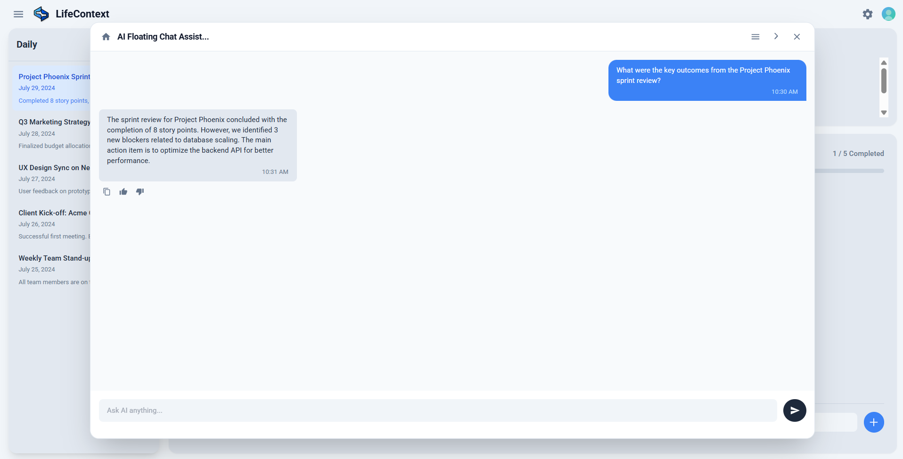
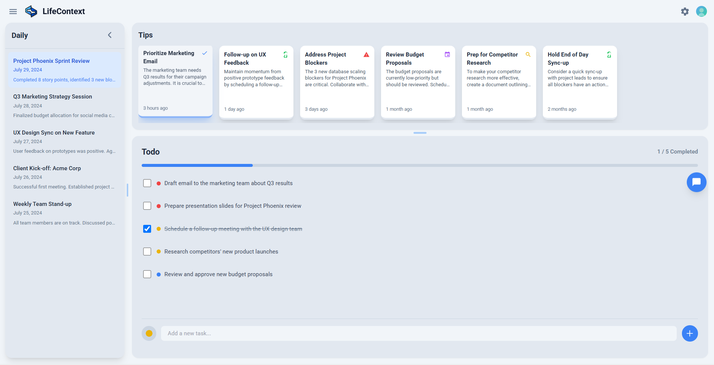

# 🧠 LifeContext


[中文](readme_zh.md) / English


## 🌍 What is Life Context

Shaped by your life. Empower yourself. Interact with the world.
* Born from your unique life context, shaping a digital twin that truly understands you.
* Delivers life-scale long-term retrieval, low-cost multimodal storage, precise context alignment, and efficient real-time compression as the core of Context Memory.
* Reimagines how you connect, opening endless possibilities for interaction, connection, and creation with the world.

## 🎯 Core Features

- **Life Context Base:** Intelligently builds a comprehensive record of your life context across web, apps, and smart devices. Continuously evolves through interaction, preserving your knowledge and experiences.
- **Context API**: Provides developers with a unified interface to store, retrieve, and manage contextual data, making cross-platform integration and expansion simpler and more efficient.
- **Companion Insights**: Proactively understands your life context and surfaces the moments, ideas, and priorities that truly matter to you—so information finds you, not the other way around.
- **Contextual Chat**: Understands your personal context to answer questions, recall memories, or reorganize inspiration—becoming an extension of your memory and mind.
- **Adaptive Scenarios**: Delivers precise, context-aware responses within specific vertical domains based on your instructions, enabling truly context-driven intelligence.
- **Task Automation**: Transforms AI from a thinker into a doer—proactively triggering and continuously executing conditional tasks based on your context, embedding intelligence into everyday life.
- **Content Generation**: Creates documents, images, audio, video, and notes on demand—helping you capture, organize, and express ideas naturally and effortlessly.
- **Digital Avatar**: As your own personal digital avatar, engage in endless interactions with the world.


## 🧩 Current Version

* Focuses on your core workspace — **web browser** — building a powerful and proactive intelligent presence.
* Automatically analyzes the web pages you browse to generate your digital life context.
* Stays out of your way while providing timely, actionable insights.


## 🚀 Quick Start

### 🛠️ Backend Configuration

#### 1️⃣ Configure the LLM and Vector Services
📦 Navigate to the `backend` directory and copy the `.env.example` file as `.env`:
```bash
cd ./backend
cp .env.example .env
```

✅ Fill in your API in the newly created `.env` file. Example configuration:

```python
# LLM API 
LLM_API_KEY = "sk-1234abcd5678efgh9012ijkl"
LLM_BASE_URL = "https://api.openai.com/v1"
LLM_MODEL = "gpt-4o-mini"

# Embedding API 
EMBEDDING_API_KEY = "sk-embed-9876mnop4321qrst"
EMBEDDING_BASE_URL = "https://api.openai.com/v1"
EMBEDDING_MODEL = "text-embedding-3-small"
```

#### 2️⃣ Set Up the Python Environment

📦 In the `backend` directory, create a virtual environment, and install all dependencies automatically using `environment.yml`.

```bash
conda env create -f environment.yml
conda activate lifecontext
```

#### 3️⃣ Start the Backend Service

📦 Run the following command to start the backend service:

```bash
python app.py
```

✅ Once successfully launched, the terminal will display port information as follows:

```
============================================================
LifeContext API Configuration Status
============================================================
✅ LLM Content Analysis: Enabled
   Model: gpt-4o-mini
✅ Vector Database: Enabled
   Model: text-embedding-3-small
============================================================
```

### 🧩 Browser Extension Configuration

#### 1️⃣ Import the Browser Extension

📦 Follow these steps:

1. Open your browser (recommended: Chrome or Edge).
2. Go to the **Manage Extensions** page and enable **Developer Mode** (top-right corner).
3. Click **Load unpacked extension** and select the folder `./Extension/extension` in the project directory.
4. Once loaded, the extension icon will appear in your browser toolbar.
5. After enabling the extension, you may disable Developer Mode for better security.

#### 2️⃣ Launch the Extension

📦 Open a new terminal in your editor, navigate to the Extension directory, and install dependencies:

```bash
cd ./Extension
npm install
node server.js
```

### 💻 Frontend Configuration

#### 1️⃣ Install Dependencies

📦 Open a new terminal and navigate to the frontend directory.

```bash
# For Windows users
cd ./frontend
npm install
```

```bash
# For macOS users
cd ./frontend
npm install
chmod +x node_modules/.bin/vite   # Grant execution permission (to prevent Vite permission errors)
```

#### 2️⃣ Start the Frontend Development Server

📦 Run the following command to start the frontend:

```bash
npm run dev
```

✅ Once started successfully, the terminal will display:

```
VITE v6.x.x  ready in 500 ms

➜  Local:   http://localhost:3000/
➜  Network: http://192.168.xx.xx:3000/
```

🎉 Open the browser and visit the address above to start using the app.

## 🌄 Scenario Introduction

1. LifeContext automatically and seamlessly records the information you browse on web pages.
2. On any webpage, click the floating chat orb to open the Chatbox and have natural conversations with AI. It understands the content you're browsing and provides instant answers, summaries, or suggestions based on your life context.




3. LifeContext seamlessly records all your browsing experiences and generates smart tips, to-dos, and daily reports based on them, appearing as instant notifications on the right side of the webpage you're browsing. You can also view all information on the homepage.



- Tips are content recommendations based on your browsing information. Click the card to view detailed tip information.


- The TodoList is automatically generated based on your activities. You can manually edit, delete, or add items.


- Click the date in the left sidebar of the homepage to view that day's daily report details.
The default generation time is 8:30 the next day, which you can modify in the settings.


4. Privacy

- If you don't want specific websites recorded in your life context, you can block the corresponding URL in the settings.
If you don't want to record any browser activity, you can disable the extension.


- You can also manage storage by selecting the Timeline page at the top left of the homepage and delete pages you don't want to keep in LifeContext.


## 🤖 Development Plan

LifeContext’s evolution roadmap unfolds across three dimensions:

1. **Breadth of context**: We begin with the browser and will gradually incorporate your PC, mobile devices, application data, and eventually smart hardware to build a seamless, end-to-end life context.
2. **Depth of AI capabilities**: We will deliver life-scale long-horizon retrieval, low-cost multi-modal context storage, precise context alignment, and efficient real-time compression across the Context Memory stack.
3. **Height of connection**: Ultimately, we aim to empower a digital twin that serves as your trusted agent, interacting with the world—under your authorization—to unlock boundless opportunities for engagement, connection, and creation.

### 🧰 Context Source Expansion Roadmap 

To enable AI to understand users better, we will integrate the following context sources in phases, based on priority.

- P0: Browser web data
- P1: Documents
- P2: Common application MCP and PC screenshots
- P3: Audio/Video files and smart hardware
- P4: DeepResearch and RSS
- P5: Mobile phone screenshots
- P6: Community knowledge base

| Priority | Integration Method       | Content                               | Progress |
| :------- | :----------------------- | :------------------------------------ | :------- |
| P0       | Browser Extension        | AI Chat                               |     ✅     |
| P0       | Browser Extension        | General Webpages                      |     ✅     |
| P0       | Browser Extension        | Video Webpages                        |          |
| P1       | File Upload              | Unstructured Documents                |          |
| P1       | File Upload              | Structured Documents                  |          |
| P1       | File Upload              | Images                                |          |
| P1       | User Input               | Notes                                 |          |
| P2       | App MCP/API              | App Information                       |          |
| P2       | PC Screenshot               | User PC Information                   |          |
| P3       | File Upload              | Video/Audio                           |          |
| P3       | Browser Extension        | Meeting Records                       |          |
| P3       | Smart Devices  (Watch)   | Health Data                           |          |
| P3       | Smart Devices  (Audio)   | Audio                                 |          |
| P3       | Smart Devices  (Video)   | Video                                 |          |
| P4       | RSS                      | Subscribed Web Updates                |          |
| P4       | Deep Research            | High-Quality Research Analysis        |          |
| P4       | File Upload              | Code                                  |          |
| P5       | Mobile Screenshot        | User Mobile Information               |          |
| P6       | Community/Imported Knowledge Base    | Official/User-Selected Knowledge Base          |          |
| P6       | Brain-Computer Interface (BCI) | Neural Encoding |          |

### 🧰 Agent Capability Expansion Roadmap

Based on the constantly enriched context, we will gradually unlock the core capabilities of the Agent.

- P0: Proactive information pushing
- P1: Document generation
- P2: Common application operations and task generation
- P3: Multi-modal generation and editing
- P4: Segmented scenario capabilities

| Priority | Feature                                     | Progress |
| :------- | :------------------------------------------ | :------- |
| P0       | Proactive Daily Report Push                 |     ✅     |
| P0       | Proactive Tips Push                         |     ✅     |
| P0       | Proactive To-do List Push                   |     ✅     |
| P0       | Digital Avatar Interaction                  |          |
| P1       | Knowledge Base                              |          |
| P1       | Internet Search                             |          |
| P1       | Multi-modal Proactive Push                  |          |
| P1       | Document Generation (PDF, EXCEL, PPT, WORD) |          |
| P1       | Mind Map                                    |          |
| P1       | Notes                                       |          |
| P2       | Application Operations (MCP)                |          |
| P2       | Timed/Conditional Triggered Tasks           |          |
| P2       | Webpage Generation (html)                   |          |
| P3       | Image Generation, Editing                   |          |
| P3       | Audio Generation, Editing                   |          |
| P3       | Video Generation, Editing                   |          |
| P4       | Segmented Scenario Capabilities             |          |

## Community

<div style="display: flex; gap: 10px; align-items: flex-start;">
  
  
</div>

## Star History

[](https://www.star-history.com/#LifeContext/lifecontext&type=date&legend=top-left)
