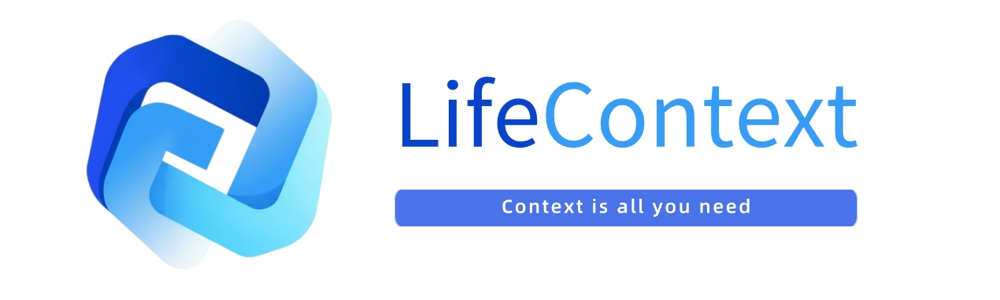

# 🧠 LifeContext



[](https://github.com/LifeContext/lifecontext/stargazers)
[](https://github.com/LifeContext/lifecontext/issues)
[](https://github.com/LifeContext/lifecontext/graphs/contributors)
[](https://github.com/LifeContext/lifecontext/blob/main/LICENSE)
[](https://github.com/LifeContext/lifecontext/commits/main)
[](https://github.com/LifeContext/lifecontext/blob/main/src/wechat.jpg?raw=true)
[](https://github.com/LifeContext/lifecontext/blob/main/src/feishu.jpg?raw=true)
[](https://discord.gg/sb8Xg8xR)
[](https://x.com/LifeContext2025)

---

**Navigation** | [Core Features](#-core-features) | [Scenario Introduction](#-scenario-introduction) | [Quick Start](#-quick-start) | [Development Plan](#-development-plan) | [Community](#community)

---

[中文](readme_zh.md) / English

## 🌍 What is Life Context

> **Open Source · Proactive · Free | Browser-based Digital Twin, the Best Alternative to ChatGPT Pulse**

Shaped by your life. Empower yourself. Interact with the world.
* Born from your unique life context, shaping a digital twin that truly understands you.
* Delivers life-scale long-term retrieval, low-cost multimodal storage, precise context alignment, and efficient real-time compression as the core of Context Memory.
* Reimagines how you connect, opening endless possibilities for interaction, connection, and creation with the world.

## 🎯 Core Features

### Proactive Push

- **Smart Tips**  
  Based on your browsing history and activity data, **proactively push** personalized smart tip cards through browser notifications or homepage display, helping you discover important information.

- **Todo Items**  
  Analyze your browsing content and activity patterns to **proactively push** todo suggestions. You can view, edit, complete, or delete these tasks on the homepage.

- **Daily Feed**  
  **Proactively push** personalized information feed cards daily, including activity summaries, todo reminders, news recommendations, knowledge cards, and more, displayed in the left panel of the homepage to help you quickly understand important information.

### Intelligent Analysis

- **Smart Content Analysis**  
  Use large language models to automatically analyze web page content, extract key information, topic classification, summaries, and other metadata, providing the foundation for subsequent intelligent recommendations and generation.

- **Timeline Management**  
  View all browsing records on the timeline page of the homepage. The system automatically summarizes and categorizes your activities, supporting time filtering, content search, record deletion, and other operations to help you review and manage your digital footprint.

### Interactive Tools

- **Floating Chat Assistant**  
  Click the floating orb on any webpage to open a chat window. The AI understands the current page content and combines your browsing history to answer questions, summarize information, or provide suggestions.

- **Prompt Optimization**  
  Automatically inject optimization buttons in mainstream AI websites like ChatGPT, Claude, Gemini, etc., optimizing your prompts based on current page content to help AI better understand your needs.

### Privacy & Security

- **Privacy Protection**  
  Configure website domains you don't want recorded in the extension settings, supporting one-click add/remove. Protect your privacy without affecting other features. You can also close the extension or delete specific records at any time.

- **Privacy Policy**  
  All your data is stored locally on your device. We do not collect, transmit, or store your data on our servers. Learn more about how we handle your data in our [Privacy Policy](privacy.md).

### Coming Soon

- **Web Multimodal Content Analysis**  
  Automatically identify and analyze multimedia content such as images and videos on web pages, extract key information and generate summaries to enrich your context information base.

- **Office Application Integration**  
  Support integration with common office applications (such as documents, spreadsheets, emails, etc.), automatically sync and analyze your office data to help AI better understand your work context.

## 🌄 Scenario Introduction

### 1️⃣ Automatic Browsing Record

LifeContext automatically and seamlessly records the information you browse on web pages, including page titles, URLs, text content, etc., providing a data foundation for subsequent intelligent analysis.

### 2️⃣ Floating Chat Assistant

On any webpage, click the floating orb to open a chat window and have natural conversations with AI. It understands the content you're browsing and provides instant answers, summaries, or suggestions based on your browsing history.


### 3️⃣ Proactive Smart Content Push

LifeContext automatically generates smart tips, todos, and daily feeds based on your browsing experiences, and displays them through browser notifications or on the homepage, so important information finds you proactively.

#### 💡 Smart Tips

Based on your browsing records, the system proactively pushes personalized smart tip cards. Click the card to view detailed content.


#### ✅ Todo Items

The system automatically generates todo suggestions based on your activities. You can manually edit, complete, or delete these tasks on the homepage.


#### 📰 Daily Feed

Click the date in the left sidebar of the homepage to view that day's feed information, including activity summaries, news recommendations, knowledge cards, etc. The default generation time is 8:30 the next day, which you can modify in the settings.


### 4️⃣ Privacy Protection

#### 🚫 URL Blacklist

If you don't want specific websites recorded in your life context, you can block the corresponding URL in the extension settings, supporting one-click add/remove. If you don't want to record any browser activity, you can disable the extension at any time.


#### 🗂️ Timeline Management

You can select the Timeline page at the top left of the homepage to manage storage, view, search, or delete page records you don't want to keep in LifeContext.


## 🚀 Quick Start

### 📋 Prerequisites

#### 1️⃣ **Python Environment**
- Install [Miniconda](https://docs.conda.io/en/latest/miniconda.html) or [Anaconda](https://www.anaconda.com/)
- Make sure the `conda` command is available

#### 2️⃣ **Node.js Environment**
- Install [Node.js](https://nodejs.org/) (version 18 or higher recommended)
- Ensure both `node` and `npm` commands are available

### 🛠️ Backend & Frontend Setup

#### 1️⃣ Configure the LLM and Vector Services
📦 Navigate to the `backend` directory and copy the `.env.example` file as `.env`:
```bash
cd backend
cp .env.example .env
```

✅ Fill in your API in the newly created `.env` file. Example configuration:

```python
# LLM API 
LLM_API_KEY = "sk-1234abcd5678efgh9012ijkl"
LLM_BASE_URL = "https://api.openai.com/v1"
LLM_MODEL = "gpt-4o-mini"

# Embedding API 
EMBEDDING_API_KEY = "sk-embed-9876mnop4321qrst"
EMBEDDING_BASE_URL = "https://api.openai.com/v1"
EMBEDDING_MODEL = "text-embedding-3-small"
```

#### 2️⃣ Create the Conda Environment (first run only)
📦 Inside the `backend` directory, create the environment from `environment.yml`:
```bash
cd backend
conda env create -f environment.yml
```

#### 3️⃣ Start All Services

##### Windows
Run the scripts inside your activated Conda environment:
```cmd
deploy.bat
```
To stop all services:
```cmd
stop.bat
```

##### Linux / macOS
Grant execute permissions on first use:
```bash
chmod +x deploy.sh stop.sh
```
Start all services:
```bash
./deploy.sh
```
Stop all services:
```bash
./stop.sh
```

🎉 Open your browser and visit [http://localhost:3000/](http://localhost:3000/).

Having issues? Check out `deploy_guide.md` for a step-by-step walkthrough.

### 🧩 Browser Extension Configuration

#### 1️⃣ Import the Browser Extension

📦 Follow these steps:

1. Open your browser (recommended: Chrome or Edge).
2. Go to the **Manage Extensions** page and enable **Developer Mode** (top-right corner).
3. Click **Load unpacked extension** and select the folder `./Extension/extension` in the project directory.
4. Once loaded, the extension icon will appear in your browser toolbar.
5. After enabling the extension, you may disable Developer Mode for better security.

🎉 Open the browser and visit [http://localhost:3000/](http://localhost:3000/)  

If you still run into issues, refer to `deploy_guide.md`.

## 🤖 Development Plan

LifeContext’s evolution roadmap unfolds across three dimensions:

1. **Breadth of context**: We begin with the browser and will gradually incorporate your PC, mobile devices, application data, and eventually smart hardware to build a seamless, end-to-end life context.
2. **Depth of AI capabilities**: We will deliver life-scale long-horizon retrieval, low-cost multi-modal context storage, precise context alignment, and efficient real-time compression across the Context Memory stack.
3. **Height of connection**: Ultimately, we aim to empower a digital twin that serves as your trusted agent, interacting with the world—under your authorization—to unlock boundless opportunities for engagement, connection, and creation.

### 🧰 Context Source Expansion Roadmap 

To enable AI to understand users better, we will integrate the following context sources in phases, based on priority.

- P0: Browser web data
- P1: Documents
- P2: Common application MCP and PC screenshots
- P3: Audio/Video files and smart hardware
- P4: DeepResearch and RSS
- P5: Mobile phone screenshots
- P6: Community knowledge base

| Priority | Integration Method       | Content                               | Progress |
| :------- | :----------------------- | :------------------------------------ | :------- |
| P0       | Browser Extension        | AI Chat                               |     ✅     |
| P0       | Browser Extension        | General Webpages                      |     ✅     |
| P0       | Browser Extension        | Video Webpages                        |          |
| P1       | File Upload              | Unstructured Documents                |          |
| P1       | File Upload              | Structured Documents                  |          |
| P1       | File Upload              | Images                                |          |
| P1       | User Input               | Notes                                 |          |
| P2       | App MCP/API              | App Information                       |          |
| P2       | PC Screenshot               | User PC Information                   |          |
| P3       | File Upload              | Video/Audio                           |          |
| P3       | Browser Extension        | Meeting Records                       |          |
| P3       | Smart Devices  (Watch)   | Health Data                           |          |
| P3       | Smart Devices  (Audio)   | Audio                                 |          |
| P3       | Smart Devices  (Video)   | Video                                 |          |
| P4       | RSS                      | Subscribed Web Updates                |          |
| P4       | Deep Research            | High-Quality Research Analysis        |          |
| P4       | File Upload              | Code                                  |          |
| P5       | Mobile Screenshot        | User Mobile Information               |          |
| P6       | Community/Imported Knowledge Base    | Official/User-Selected Knowledge Base          |          |
| P6       | Brain-Computer Interface (BCI) | Neural Encoding |          |

### 🧰 Agent Capability Expansion Roadmap

Based on the constantly enriched context, we will gradually unlock the core capabilities of the Agent.

- P0: Proactive information pushing
- P1: Document generation
- P2: Common application operations and task generation
- P3: Multi-modal generation and editing
- P4: Segmented scenario capabilities

| Priority | Feature                                     | Progress |
| :------- | :------------------------------------------ | :------- |
| P0       | Proactive Daily Report Push                 |     ✅     |
| P0       | Proactive Tips Push                         |     ✅     |
| P0       | Proactive To-do List Push                   |     ✅     |
| P0       | Digital Avatar Interaction                  |          |
| P1       | Knowledge Base                              |          |
| P1       | Internet Search                             |          |
| P1       | Multi-modal Proactive Push                  |          |
| P1       | Document Generation (PDF, EXCEL, PPT, WORD) |          |
| P1       | Mind Map                                    |          |
| P1       | Notes                                       |          |
| P2       | Application Operations (MCP)                |          |
| P2       | Timed/Conditional Triggered Tasks           |          |
| P2       | Webpage Generation (html)                   |          |
| P3       | Image Generation, Editing                   |          |
| P3       | Audio Generation, Editing                   |          |
| P3       | Video Generation, Editing                   |          |
| P4       | Segmented Scenario Capabilities             |          |

## Community

<div style="display: flex; gap: 10px; align-items: flex-start;">
  
  
</div>

## Star History

[](https://www.star-history.com/#LifeContext/lifecontext&type=date&legend=top-left)
