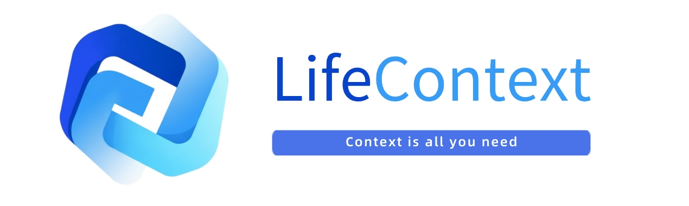
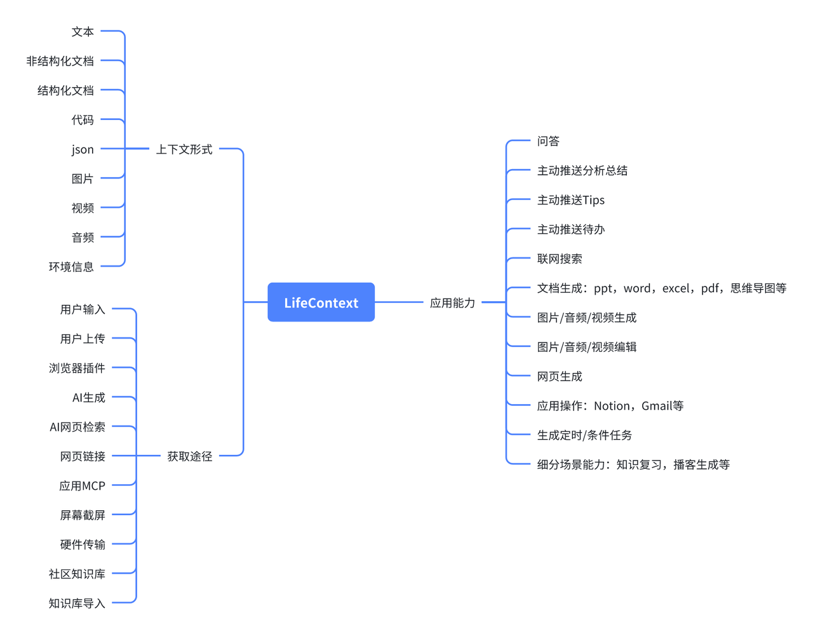
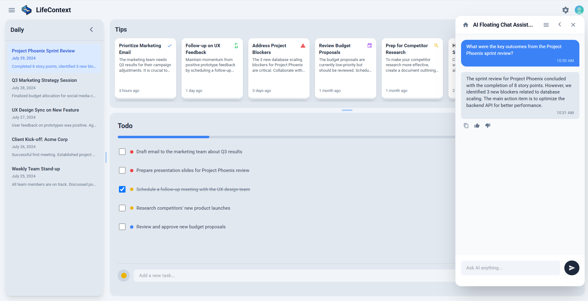
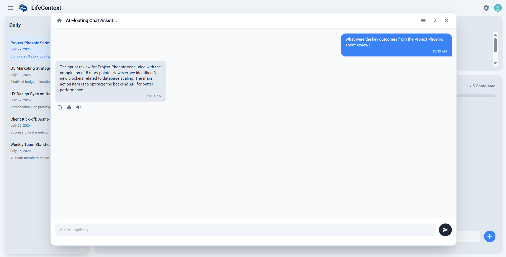
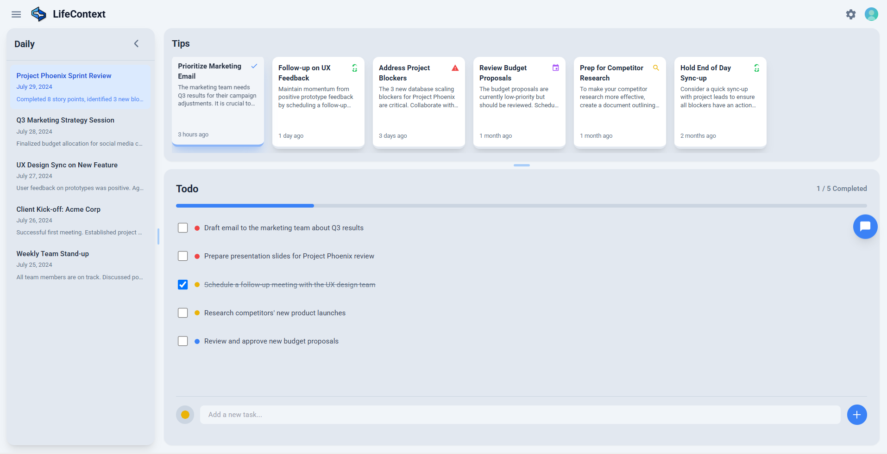
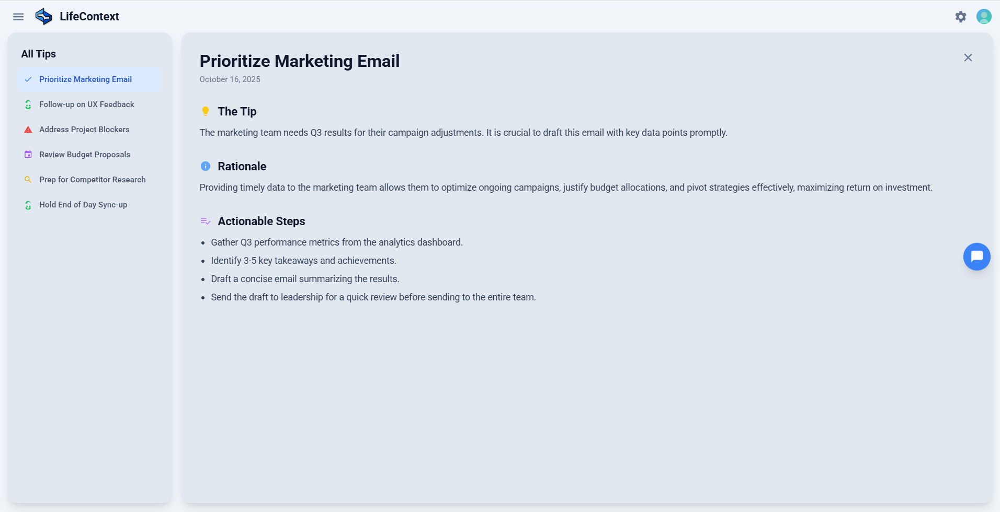
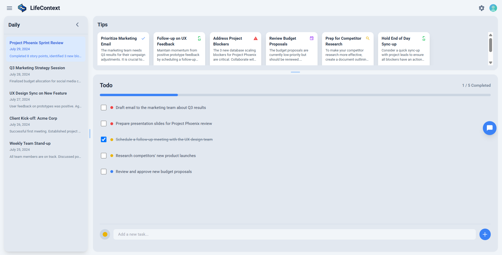
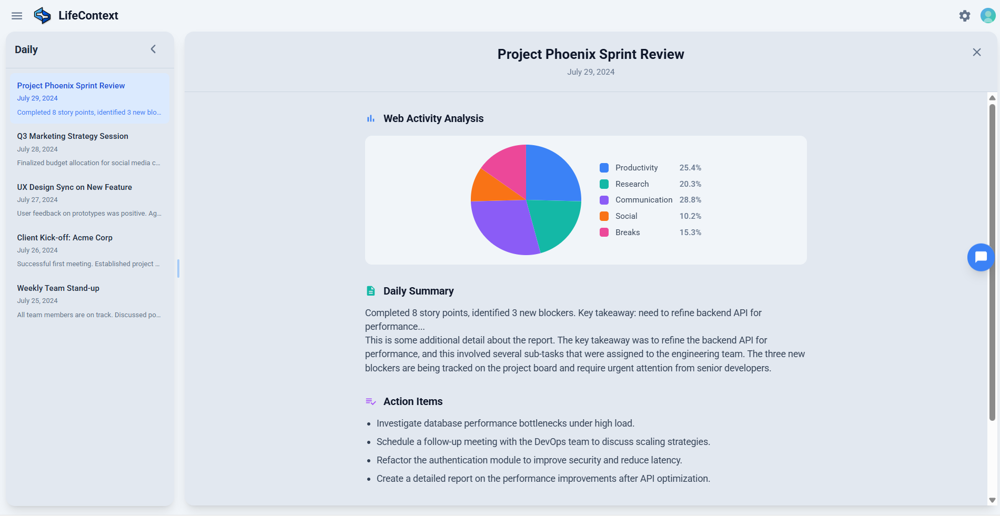
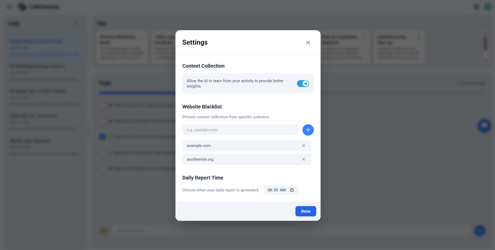
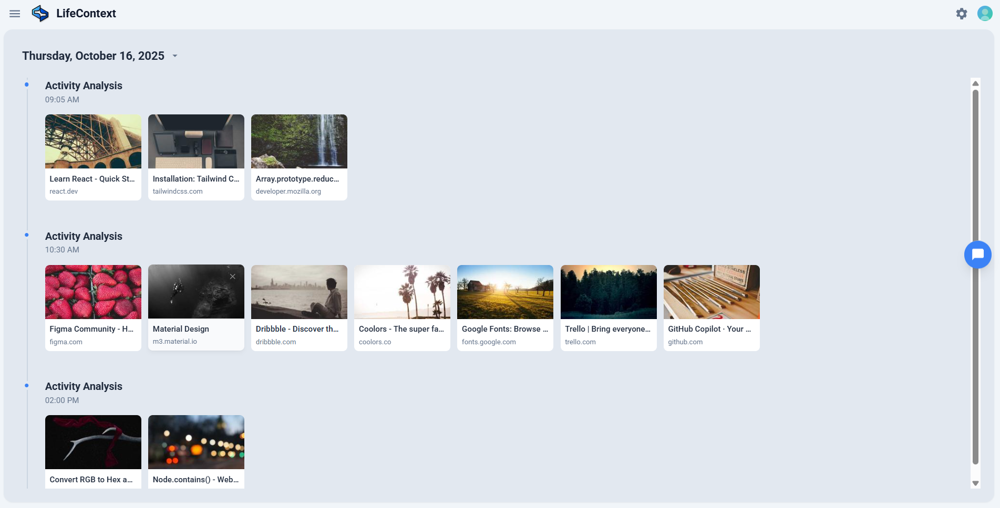

# 🧠 人生上下文



## 🌍 什么是人生上下文

- 把人生所见所闻所做化为**AI 上下文**，让 AI 更懂你，并主动执行。
- 一个了解你完整经历的**人生搜索引擎**。它能帮你串联起所有过往，也能帮你精准调取任何一刻的信息。
- 提供**开源实现**和标准上下文接口。

## 🎯 核心功能

- **个人上下文库**：智能构建你的人生上下文，覆盖网页、应用与智能设备，通过持续交互不断学习与进化，沉淀知识与体验。
- **标准化上下文接口**：为开发者提供统一接口，用于存储、读取与管理上下文数据，让跨平台集成与扩展更加简单高效。
- **伴随式洞察**：主动洞察你的人生上下文，在恰当的时刻呈现对你真正重要的时刻、想法与优先事项，让信息不再被动等待。
- **上下文对话**：理解你的人生上下文，随时回答提问、回忆片段或重组灵感，成为您思维与记忆的延伸。
- **场景自适应**：基于你的指令，在特定垂直场景中提供更精准、更具执行力的响应，实现真正的“上下文驱动智能”。
- **驱动任务**：让 AI 从思考者进化为行动者，根据你的语境主动触发、持续执行多种条件任务，让智能真正融入你的人生。
- **内容生成**：根据需求生成文档、图片、音频、视频与笔记，高效整理与表达你的想法，让创造回归自然流畅。



## 🧩 当前版本

- 聚焦您的核心工作空间——**网页浏览器**，建立强大且主动的智能存在。
- 全自动地对您浏览的网页进行分析，生成您的数字人生上下文。
- 不打扰您的心流状态，主动提供及时、可行动的洞察。
- 代码即将开源

## 🚀 快速开始
### 📋 前置准备

#### 1️⃣ **Python 环境**
   - 安装 [Miniconda](https://docs.conda.io/en/latest/miniconda.html) 或 [Anaconda](https://www.anaconda.com/)
   - 确保 `conda` 命令可用

#### 2️⃣ **Node.js 环境**
   - 安装 [Node.js](https://nodejs.org/) (推荐 v18 或更高版本)
   - 确保 `node` 和 `npm` 命令可用
### 🛠️ 前后端配置与启动

#### 1️⃣ 配置大模型与向量服务
📦 进入 backend 目录，复制 `.env.example`文件并命名为`.env`：
```bash
cd backend
cp .env.example .env
```

✅ 将你的模型和向量数据库接口信息填入刚刚生成的`.env`中，示例如下：
```python
# LLM API 
LLM_API_KEY = "sk-1234abcd5678efgh9012ijkl"
LLM_BASE_URL = "https://api.openai.com/v1"
LLM_MODEL = "gpt-4o-mini"

# Embedding API 
EMBEDDING_API_KEY = "sk-embed-9876mnop4321qrst"
EMBEDDING_BASE_URL = "https://api.openai.com/v1"
EMBEDDING_MODEL = "text-embedding-3-small"

```

#### 2️⃣ 创建conda环境（仅首次运行需要）
📦 在 conda 环境 backend 目录下，根据 `environment.yml` 创建环境：
```bash
conda env create -f environment.yml
```

#### 3️⃣ 启动服务
#### Windows 系统

启动所有服务

在conda环境中执行：

```cmd
deploy.bat
```

停止所有服务

在conda环境中执行：

```cmd
stop.bat
```

#### Linux / macOS 系统

首次使用：添加执行权限

```bash
chmod +x deploy.sh stop.sh
```

启动所有服务

```bash
./deploy.sh
```

停止所有服务

```bash
./stop.sh
```


### 🧩 浏览器插件（Extension）配置

#### 1️⃣ 导入浏览器插件
📦 步骤如下：

1. 打开浏览器（推荐使用 Chrome 或 Edge）。
2. 进入 [管理扩展程序] 页面，打开右上角的 [开发者模式] 。
3. 点击 [加载已解压的扩展程序] ，选择项目目录下的 `./Extension/extension` 文件夹。
4. 加载完成后，即可在浏览器工具栏中看到插件图标。
5. 插件功能启用后，可关闭开发者模式以提升安全性。

🎉打开浏览器访问 http://localhost:3000/ 

如果部署还有问题，请参考 [deploy_guide_zh.md](deploy_guide_zh.md)

## 🌄 场景介绍

1. LifeContext会自动无感地记录您在网页上浏览的信息。
2. 在任意网页上，点击悬浮球即可打开 Chatbox，与 AI 自然对话。它能理解您正在浏览的内容，结合人生上下文提供即时回答、总结或建议。





3. LifeContext将无感记录您的一切浏览体验并据此生成智能提示、待办和日报，并以即时通知的形式浮现在您的浏览的网页右侧，您也可以在主页上查看所有信息



- 提示信息是根据您的浏览的信息进行的内容推送，您可点击卡片查看详细的提示信息。



- TodoList是参考您的活动自动生成，您可以手动编辑、删除或添加。



- 点击主页页面左侧边栏中的日期可查看该日日报详情。
默认生成时间为次日8:30，您可通过设置进行修改。



4. 隐私问题

- 如您不想将特定网站记录在您的人生上下文中，可以在设置中屏蔽对应url。
如您不想记录任何浏览器行为可以关闭插件。



- 您也可在主页左上角选择TimeLine页面进行存储管理，删除您不想留存在LifeContext的页面



## 🤖 开发进度

### 🧰 上下文来源扩展路线图

为了让 AI 更懂用户，我们将分阶段、按优先级接入以下上下文来源。

- P0: 浏览器网页数据
- P1: 文档
- P2: 常见应用 MCP 和 PC 屏幕截图
- P3: 音视频文件和智能硬件
- P4: DeepResearch 和 RSS
- P5: 手机屏幕截图
- P6: 社区知识库

| 优先级 | 接入方式         | 内容                | 进度 |
| :----- | :--------------- | :------------------ | :--- |
| P0     | 浏览器插件       | AI 对话             |   ✅   |
| P0     | 浏览器插件       | 常规网页            |   ✅   |
| P0     | 浏览器插件       | 视频网页            |      |
| P1     | 文件上传         | 非结构化文档        |      |
| P1     | 文件上传         | 结构化文档          |      |
| P1     | 文件上传         | 图片                |      |
| P1     | 用户输入         | 笔记                |      |
| P2     | 应用 MCP/API     | 应用信息            |      |
| P2     | PC屏幕截图       | 用户 PC 信息        |      |
| P3     | 文件上传         | 视频/音频           |      |
| P3     | 浏览器插件       | 会议记录            |      |
| P3     | 智能硬件（手表） | 健康数据            |      |
| P3     | 智能硬件（音频） | 音频                |      |
| P3     | 智能硬件（视频） | 视频                |      |
| P4     | RSS              | 订阅网页更新信息    |      |
| P4     | Deep Research    | 高质量研究分析      |      |
| P4     | 文件上传         | 代码                |      |
| P5     | 手机截图         | 用户移动端信息      |      |
| P6     | 社区/导入知识库       | 官方/用户精选知识库      |      |
| P6     | 脑机接口      | 神经编码 |      |

### 🧰 Agent 能力扩展路线图

基于不断丰富的上下文，我们将逐步解锁 Agent 的核心能力。

- P0: 主动信息推送
- P1: 文档生成
- P2: 常见应用操作和任务生成
- P3: 多模态生成与编辑
- P4: 细分场景能力

| 优先级 | 功能                             | 进度 |
| :----- | :------------------------------- | :--- |
| P0     | 主动推送日报                     |   ✅   |
| P0     | 主动推送提示 (Tips)              |   ✅   |
| P0     | 主动推送待办事项                 |   ✅   |
| P0     | 时间轴 (Timeline)                |   ✅   |
| P1     | 知识库                           |      |
| P1     | 联网搜索                         |      |
| P1     | 多模态主动推送                   |      |
| P1     | 文档生成 (PDF, EXCEL, PPT, WORD) |      |
| P1     | 思维导图                         |      |
| P1     | 笔记                             |      |
| P2     | 应用操作 (MCP)                   |      |
| P2     | 定时/条件触发任务                |      |
| P2     | 网页生成 (html)                  |      |
| P3     | 图片生成、编辑                   |      |
| P3     | 音频生成、编辑                   |      |
| P3     | 视频生成、编辑                   |      |
| P4     | 细分场景能力                     |      |

## Community

<div style="display: flex; gap: 10px; align-items: flex-start;">
  
  
</div>

## Star History

[](https://www.star-history.com/#LifeContext/lifecontext&type=date&legend=top-left)
