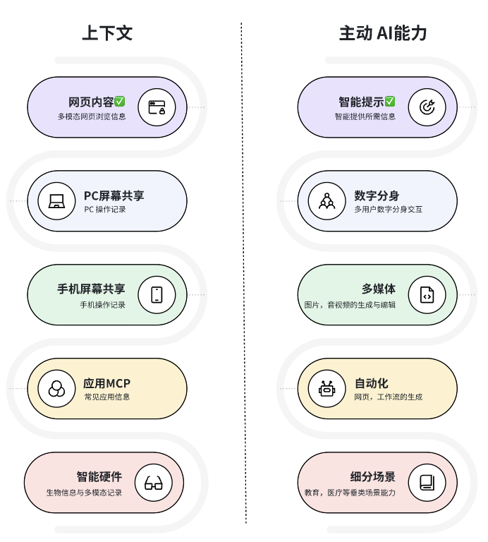

# 🧠 人生上下文


[](https://github.com/LifeContext/lifecontext/stargazers)
[](https://github.com/LifeContext/lifecontext/issues)
[](https://github.com/LifeContext/lifecontext/graphs/contributors)
[](https://github.com/LifeContext/lifecontext/blob/main/LICENSE)
[](https://github.com/LifeContext/lifecontext/commits/main)
[](https://github.com/LifeContext/lifecontext/blob/main/src/wechat.jpg?raw=true)
[](https://github.com/LifeContext/lifecontext/blob/main/src/feishu.jpg?raw=true)
[](https://discord.gg/sb8Xg8xR)
[](https://x.com/LifeContext2025)

---

**导航** | [产品对比](#-产品对比) | [核心功能](#-核心功能) | [场景介绍](#-场景介绍) | [快速开始](#-快速开始) | [开发计划](#-开发计划) | [社区](#community)

---

## 🌍 LifeContext

> **开源 · 主动 · 免费 | 基于浏览器的数字分身，ChatGPT Pulse 的最佳平替**

Shaped by your life. Empower yourself. Interact with the world.
- 源于您独一无二的人生上下文，为您塑造一个真正'懂你'的数字分身。
- 提供人生级别的长周期检索，低成本的多模态数据存储，精确的上下文对齐，高效的实时上下文压缩技术等等Context Memory底层能力。
- 重塑您的连接方式，与这个世界展开无限可能的交互、连接与创造。

## 🎬 产品演示

<video width="100%" controls>
  <source src="src/lifecontext.mov" type="video/quicktime">
  您的浏览器不支持视频播放。
</video>

## 📊 产品对比

LifeContext 与同类产品的核心差异对比：

| 功能特性 | LifeContext | MineContext | ChatGPT Pulse | DayFlow | 详细描述 |
|:---------|:------------|:------------|:--------------|:--------|:---------|
| **浏览器深度集成** | ✅ | ❌ | ❌ | ❌ | 原生浏览器插件，深度理解当前页面内容 |
| **智能洞察** | ✅ | ❌ | ❌ | ❌ | 基于浏览活动主动生成补充性洞察，而非简单总结，帮助发现隐藏信息和趋势 |
| **活动总结** | ✅ | ✅ | ✅ | ✅ | 自动汇总活动，按时间生成活动总结 |
| **每日精选** | ✅ | ❌ | ❌ | ✅ | 包含活动总结、待办提醒、新闻推荐、知识卡片等多种类型内容 |
| **提示词强化功能** | ✅ | ❌ | ❌ | ❌ | 在 ChatGPT、Claude、Gemini 等 AI 对话页面自动优化提示词 |
| **悬浮球聊天助手** | ✅ | ❌ | ❌ | ❌ | 在任意网页上通过悬浮球快速访问 AI 聊天功能 |
| **本地数据存储** | ✅ | ✅ | ❌ | ✅ | 所有数据存储在本地设备，不上传到服务器 |
| **完全开源** | ✅ | ✅ | ❌ | ✅  | 代码完全开放，可自由查看、修改和扩展 |

**LifeContext 的核心优势：**
- 🎯 **完全开源**：代码透明，可自由定制和扩展
- 🔒 **隐私优先**：所有数据存储在本地，不上传到服务器
- 🌐 **浏览器原生**：深度集成浏览器，无需额外应用
- 🆓 **完全免费**：无订阅费用，无使用限制
- 🚀 **持续迭代**：社区驱动，功能快速更新

## 🎯 核心功能

### 主动推送类

- **智能洞察**  
  基于您的浏览记录和活动数据，**主动推送**个性化的智能洞察卡片，通过浏览器通知或主页展示，帮助您发现重要信息。

- **待办事项**  
  分析您的浏览内容和活动模式，**主动推送**待办事项建议，您可以在主页上查看、编辑、完成或删除这些任务。

- **每日精选**  
  每天**主动推送**个性化的信息流卡片，包括活动总结、待办提醒、新闻推荐、知识卡片等多种类型，在主页左侧面板展示，帮助您快速了解重要信息。

### 智能分析类

- **智能内容分析**  
  使用大语言模型自动分析网页内容，提取关键信息、主题分类、摘要等元数据，为后续的智能推荐和生成提供基础。

- **时间线管理**  
  在主页的时间线页面查看所有浏览记录，系统会自动对您的活动进行总结和分类，支持按时间筛选、搜索内容、删除记录等操作，帮助您回顾和管理数字足迹。

### 交互工具类

- **悬浮聊天助手**  
  在任意网页上点击悬浮球即可打开聊天窗口，AI 能够理解当前页面内容并结合您的浏览历史回答问题、总结信息或提供建议。

- **提示词优化**  
  在 ChatGPT、Claude、Gemini 等主流 AI 网站中，自动注入优化按钮，基于当前页面内容优化您的提示词，让 AI 更好地理解您的需求。

### 隐私与安全

- **隐私保护**  
  在插件设置中配置不想被记录的网站域名，支持一键添加/移除，保护隐私的同时不影响其他功能使用。您也可以随时关闭插件或删除特定记录。

- **隐私政策**  
  您的所有数据都存储在您的本地设备上。我们不会在我们的服务器上收集、传输或存储您的数据。详细了解我们如何处理您的数据，请查看我们的[隐私政策](privacy.md)。

### 即将推出

- **网页多模态内容分析**  
  自动识别和分析网页中的图片、视频等多媒体内容，提取关键信息并生成摘要，丰富您的上下文信息库。

- **办公应用接入**  
  支持接入常见办公应用（如文档、表格、邮件等），自动同步和分析您的办公数据，让 AI 更好地理解您的工作上下文。

## 🌄 场景介绍

### 1️⃣ Insight 智能洞察

在主页的 Insight 页面中，左侧展示您的浏览网页活动时间线，右侧实时生成基于这些活动的智能洞察。系统会自动分析您的浏览模式、内容偏好和关注点，为您提供个性化的洞察建议，帮助您发现隐藏的信息和趋势。


### 2️⃣ Daily Picks 每日精选

系统会根据您的浏览历史和活动模式，每天自动生成个性化的精选内容。包括活动总结、重要信息提醒、知识卡片等，让您快速了解当天的关键信息。默认生成时间为次日 8:30，您可通过设置进行修改。


### 3️⃣ 悬浮球助手

在任意网页上，点击右下角的悬浮球即可快速访问 LifeContext 功能。悬浮球提供便捷的入口，让您随时与 AI 助手交互，无需离开当前页面。


### 4️⃣ 智能聊天

点击悬浮球打开聊天窗口，与 AI 进行自然对话。AI 能够理解您正在浏览的页面内容，并结合您的浏览历史、活动记录和上下文信息，为您提供精准的回答、总结或建议。


### 5️⃣ 隐私保护

在插件设置中，您可以灵活配置隐私保护选项。支持添加 URL 黑名单，一键屏蔽不想被记录的网站；也可以随时查看、搜索或删除已保存的浏览记录，完全掌控您的数据隐私。


## 🚀 快速开始
### 📋 前置准备

#### 1️⃣ **Python 环境**
   - 安装 [Miniconda](https://docs.conda.io/en/latest/miniconda.html) 或 [Anaconda](https://www.anaconda.com/)
   - 确保 `conda` 命令可用

#### 2️⃣ **Node.js 环境**
   - 安装 [Node.js](https://nodejs.org/) (推荐 v18 或更高版本)
   - 确保 `node` 和 `npm` 命令可用
### 🛠️ 前后端配置与启动

#### 1️⃣ 配置大模型与向量服务
📦 进入 backend 目录，复制 `.env.example`文件并命名为`.env`：
```bash
cd backend
cp .env.example .env
```

✅ 将你的模型和向量数据库接口信息填入刚刚生成的`.env`中，示例如下：
```python
# LLM API 
LLM_API_KEY = "sk-1234abcd5678efgh9012ijkl"
LLM_BASE_URL = "https://api.openai.com/v1"
LLM_MODEL = "gpt-4o-mini"

# Embedding API 
EMBEDDING_API_KEY = "sk-embed-9876mnop4321qrst"
EMBEDDING_BASE_URL = "https://api.openai.com/v1"
EMBEDDING_MODEL = "text-embedding-3-small"

```

#### 2️⃣ 创建conda环境（仅首次运行需要）
📦 在 conda 环境 backend 目录下，根据 `environment.yml` 创建环境：
```bash
cd backend
conda env create -f environment.yml
```

#### 3️⃣ 启动服务
#### Windows 系统

启动所有服务

在conda环境中执行：

```cmd
deploy.bat
```

停止所有服务

在conda环境中执行：

```cmd
stop.bat
```

#### Linux / macOS 系统

首次使用：添加执行权限

```bash
chmod +x deploy.sh stop.sh
```

启动所有服务

```bash
./deploy.sh
```

停止所有服务

```bash
./stop.sh
```


### 🧩 浏览器插件（Extension）配置

#### 1️⃣ 导入浏览器插件
📦 步骤如下：

1. 打开浏览器（推荐使用 Chrome 或 Edge）。
2. 进入 [管理扩展程序] 页面，打开右上角的 [开发者模式] 。
3. 点击 [加载已解压的扩展程序] ，选择项目目录下的 `./Extension/extension` 文件夹。
4. 加载完成后，即可在浏览器工具栏中看到插件图标。
5. 插件功能启用后，可关闭开发者模式以提升安全性。

🎉打开浏览器访问 http://localhost:3000/ 

如果部署还有问题，请参考 deploy_guide_zh.md

## 🤖 开发计划

LifeContext 的进化蓝图将围绕三个维度展开：

1. **上下文的「广度」**：我们始于浏览器，将逐步融合您的PC、移动设备、应用数据，直至智能硬件，构筑一个无缝的、全方位的人生上下文。
2. **AI能力的「深度」**：功能上，我们提供人生级别的长周期检索，低成本的多模态上下文存储，精确的上下文对齐，高效的实时上下文压缩技术等 Context Memory 底层能力。
3. **连接的「高度」**：最终，我们将实现数字分身作为你的专属代理，在授权下，与这个世界展开无限可能的交互、连接与创造。



### 🧰 上下文来源扩展路线图

为了让 AI 更懂用户，我们将分阶段、按优先级接入以下上下文来源。

- P0: 浏览器网页数据
- P1: 文档
- P2: 常见应用 MCP 和 PC 屏幕截图
- P3: 音视频文件和智能硬件
- P4: DeepResearch 和 RSS
- P5: 手机屏幕截图
- P6: 社区知识库

| 优先级 | 接入方式         | 内容                | 进度 |
| :----- | :--------------- | :------------------ | :--- |
| P0     | 浏览器插件       | AI 对话             |   ✅   |
| P0     | 浏览器插件       | 常规网页            |   ✅   |
| P0     | 浏览器插件       | 视频网页            |      |
| P1     | 文件上传         | 非结构化文档        |      |
| P1     | 文件上传         | 结构化文档          |      |
| P1     | 文件上传         | 图片                |      |
| P1     | 用户输入         | 笔记                |      |
| P2     | 应用 MCP/API     | 应用信息            |      |
| P2     | PC屏幕共享       | 用户 PC 信息        |      |
| P3     | 文件上传         | 视频/音频           |      |
| P3     | 浏览器插件       | 会议记录            |      |
| P3     | 智能硬件（手表） | 健康数据            |      |
| P3     | 智能硬件（音频） | 音频                |      |
| P3     | 智能硬件（视频） | 视频                |      |
| P4     | RSS              | 订阅网页更新信息    |      |
| P4     | Deep Research    | 高质量研究分析      |      |
| P4     | 文件上传         | 代码                |      |
| P5     | 手机屏幕截图         | 用户移动端信息      |      |
| P6     | 社区/导入知识库       | 官方/用户精选知识库      |      |
| P6     | 脑机接口      | 神经编码 |      |

### 🧰 Agent 能力扩展路线图

基于不断丰富的上下文，我们将逐步解锁 Agent 的核心能力。

- P0: 主动信息推送
- P1: 文档生成
- P2: 常见应用操作和任务生成
- P3: 多模态生成与编辑
- P4: 细分场景能力

| 优先级 | 功能                             | 进度 |
| :----- | :------------------------------- | :--- |
| P0     | 主动推送日报                     |   ✅   |
| P0     | 主动推送洞察                     |   ✅   |
| P0     | 主动推送待办事项                 |   ✅   |
| P0     | 数字分身交互               |     |
| P1     | 知识库                           |      |
| P1     | 联网搜索                         |      |
| P1     | 多模态主动推送                   |      |
| P1     | 文档生成 (PDF, EXCEL, PPT, WORD) |      |
| P1     | 思维导图                         |      |
| P1     | 笔记                             |      |
| P2     | 应用操作 (MCP)                   |      |
| P2     | 定时/条件触发任务                |      |
| P2     | 网页生成 (html)                  |      |
| P3     | 图片生成、编辑                   |      |
| P3     | 音频生成、编辑                   |      |
| P3     | 视频生成、编辑                   |      |
| P4     | 细分场景能力                     |      |

## Community

<div style="display: flex; gap: 10px; align-items: flex-start;">
  
  
</div>

## Star History

[](https://www.star-history.com/#LifeContext/lifecontext&type=date&legend=top-left)
